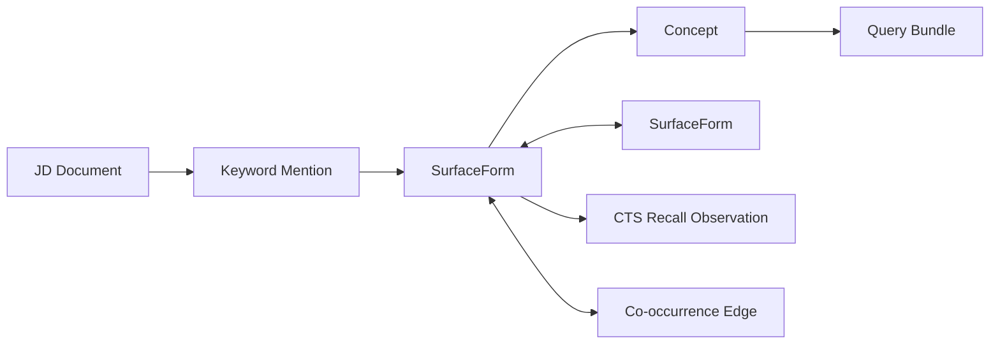
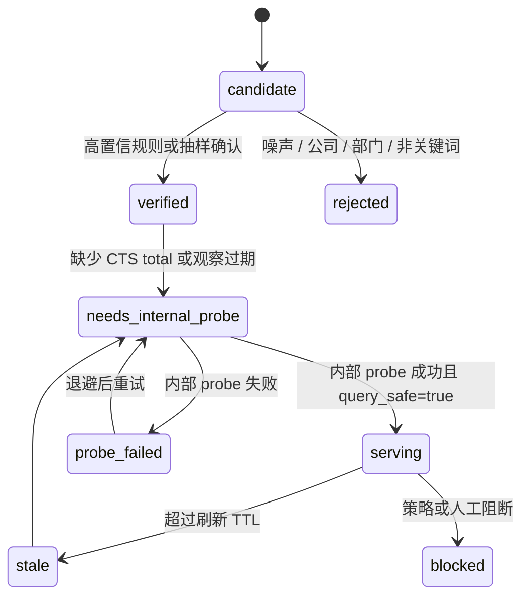

# 01. 领域模型

## 总体模型

第一阶段的领域模型围绕“关键词”而不是“公司 / 领域 / 部门”。核心对象如下：

`CTS Recall Observation` 由我们内部离线构建流程产生。用户本地 runtime 只读取 observation summary，不创建新 observation。

## 聚合根

### KeywordGraphSnapshot

关键词包对 SeekTalent 暴露的是一个已发布的只读快照，而不是正在构建中的图。

职责：

- 固定一版概念、词面、边、统计摘要。
- 支持 SeekTalent 运行时引用同一个版本。
- 支持通过替换 snapshot 文件回滚到上一版。

关键字段：

| 字段 | 含义 |
| --- | --- |
| `kg_snapshot_id` | 快照唯一 ID |
| `built_at` | 快照构建完成时间 |
| `jd_corpus_version` | JD 语料版本 |
| `cts_probe_window_start/end` | 内部 CTS 探测窗口 |
| `snapshot_schema_version` | snapshot schema 版本 |
| `selection_policy_version` | 查询选择策略版本 |
| `status` | candidate / released / archived / failed |

### Concept

概念不是词面，而是若干词面背后的同一关键词含义。

例子：

- Concept: `Kubernetes`
  - Surface: `Kubernetes`
  - Surface: `k8s`
  - Surface: `容器编排`
- Concept: `推荐系统召回`
  - Surface: `召回算法`
  - Surface: `推荐召回`
  - Surface: `向量召回`

第一阶段 `Concept` 的类型只允许关键词相关类型：

| 类型 | 示例 |
| --- | --- |
| `skill` | 机器学习、推荐系统、供应链计划 |
| `tool` | Kubernetes、Spark、Figma |
| `framework` | Spring Cloud、React、LangChain |
| `language` | Python、Java、C++ |
| `certificate` | PMP、CPA、CFA |
| `method` | A/B 测试、RAG、CI/CD |
| `job_keyword` | 后端开发、算法工程师、数据分析 |
| `qualification` | 本科、硕士、英语六级 |

不允许的类型：`company`、`industry`、`department`、`person`。

### SurfaceForm

真实被搜索框使用的字符串。`SurfaceForm` 是最重要的 runtime 对象，因为 SeekTalent 最终要把词面交给 CTS retrieval。

职责：

- 保存原始词面与规范化词面。
- 保存语言、大小写敏感性、是否适合直接搜索。
- 保存预计算 CTS 召回数量摘要。
- 保存和其他词面的别名、缩写、翻译、共现关系。

### KeywordMention

某个关键词在某份 JD 中出现的证据。

职责：

- 保留 JD 句子或段落引用。
- 标注关键词来自“岗位职责”“任职要求”“加分项”等部分。
- 区分 required / preferred / nice_to_have。
- 不让 LLM 或规则直接把抽取结果升级为最终查询词。

### CTSRecallObservation

一次内部构建流程对 CTS 搜索系统的关键词 count-only 探测结果。

职责：

- 保存请求摘要、`data.total`、延迟、错误、重试和限速信息。
- 形成关键词可搜性画像。
- 不保存原始简历文本、候选人列表或 CTS key。

### QueryBundle

面向 SeekTalent 的 runtime 输出对象。

一个 JD 不应该只返回一个关键词列表，而应返回若干查询族：

| 查询族 | 目的 |
| --- | --- |
| `anchor` | 稳定召回，避免过窄 |
| `precision` | 收窄过宽关键词 |
| `alias_probe` | 尝试同概念别名 |
| `exploration` | 低置信新词或长尾探索，默认数量少 |
| `fallback` | 关键词包不确定时给 SeekTalent 原策略兜底 |

## 关系类型

| 关系 | 起点 | 终点 | 含义 |
| --- | --- | --- | --- |
| `HAS_SURFACE` | Concept | SurfaceForm | 概念拥有词面 |
| `ALIAS_OF` | SurfaceForm | SurfaceForm | 同义 / 近义词面 |
| `ABBREVIATES` | SurfaceForm | SurfaceForm | 缩写关系，如 k8s -> Kubernetes |
| `TRANSLATES_TO` | SurfaceForm | SurfaceForm | 中英文翻译 |
| `BROADER_THAN` | Concept | Concept | 上下位关键词，不用于公司 / 领域 |
| `CO_OCCURS_WITH` | SurfaceForm | SurfaceForm | JD 中共现 |
| `MENTIONED_AS` | KeywordMention | SurfaceForm | JD 证据指向词面 |
| `HAS_RECALL_OBSERVATION` | SurfaceForm | CTSRecallObservation | 词面被内部 CTS probe 观察过 |

## 状态机

### SurfaceForm 状态

`needs_internal_probe` 只存在于内部构建流程。用户本地 runtime 不从该状态触发 CTS。

### Concept 状态

| 状态 | 含义 |
| --- | --- |
| `candidate` | 由抽取或聚类产生，尚未确认 |
| `active` | 可参与 runtime 推荐 |
| `needs_review` | 高影响但有歧义，需要人工合并 / 拆分 |
| `deprecated` | 已被更好的概念替代，不再推荐 |
| `blocked` | 非关键词或敏感 / 不合规，不参与推荐 |

## 设计取舍

第一阶段不追求“本体完美”。系统只要做到三件事就够：

1. 不把不同概念错误合并。
2. 不把公司、部门、行业误当成关键词图谱的核心节点。
3. 能用预计算 CTS 召回数量决定一个词能不能搜、怎么搜。
