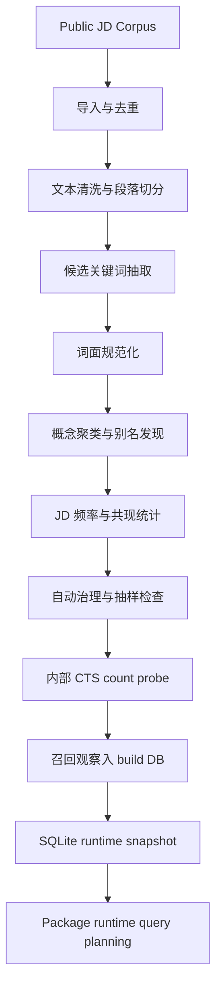
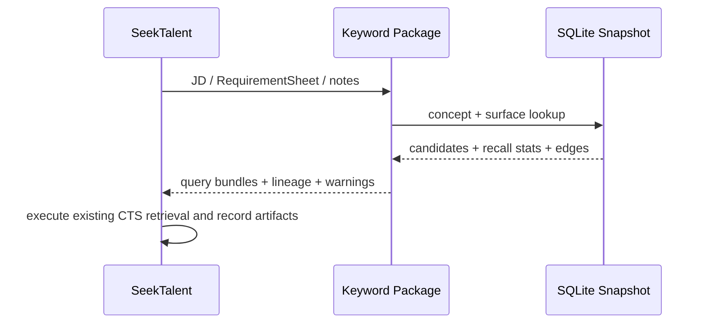

# 03. 从 JD 到关键词图谱的数据流

## 总流程

CTS probe 只发生在我们内部。用户本地只拿到 `K` 之后的 snapshot。

## 阶段 1：JD 导入与去重

第一版 bootstrap 输入：

- 本机已确认的 9530 条中国大陆公开 JD 样本。
- 后续可继续追加的公开 JD。
- 手工上传或人工整理的特殊岗位 JD。

导入动作：

1. 生成 `jd_id`。
2. 计算 `content_hash` 去重。
3. 保存原文 artifact 引用。
4. 标记语言与质量。
5. 不把公司、领域、部门建图；它们最多作为原始元数据保留，第一阶段不参与模型。

输出：`JDDocument`。

## 阶段 2：文本清洗与段落切分

目标不是做复杂语义理解，而是让关键词抽取有明确上下文。

切分类型：

- `title`
- `responsibility`
- `requirement`
- `preferred`
- `qualification`
- `other`

关键规则：

- 保留原始字符 offset，方便回溯证据。
- 切分失败时不要丢弃文本，放到 `other`。
- 对“任职要求”“岗位要求”“加分项”“优先条件”等标题做高精度识别。

输出：`JDSection`。

## 阶段 3：候选关键词抽取

采用多路抽取，不让任何一路直接成为最终真相。

### 规则抽取

适合高精度、低成本关键词：

- 英文技术栈：`Python`, `Java`, `C++`, `Kubernetes`, `Spark`, `React`。
- 常见证书：`PMP`, `CPA`, `CFA`, `软考`, `一建`。
- 版本 / 框架组合：`Vue3`, `Spring Cloud`, `PyTorch`。
- 枚举结构：`熟悉 A/B/C`、`掌握 A、B、C`、`有 A 或 B 经验`。

### 词典 / 种子表抽取

来源：

- 历史成功查询词。
- 人工维护的技能词表。
- SeekTalent 历史 `sent_query_history` 和 `term_surface_audit`。
- 外部公开技能 taxonomy 的映射结果，但第一阶段只吸收关键词，不展开公司 / 领域。

### 统计抽取

用于发现长尾词：

- 高频 n-gram。
- JD 标题和要求段落里的重复短语。
- 与已知关键词高共现的新词。
- 中英混写模式。

### LLM 辅助抽取

LLM 只处理规则难覆盖的复杂表达，例如：

- “负责召回链路的特征工程与粗排策略优化” → 可能抽出 `召回链路`、`特征工程`、`粗排策略`。
- “有多模态内容理解和向量检索经验” → 可能抽出 `多模态内容理解`、`向量检索`。

LLM 输出必须包含证据片段、置信度和类型，不允许直接写入 serving snapshot。

输出：`KeywordMention`。

## 阶段 4：词面规范化

规范化不是简单小写。不同词面可能代表不同搜索行为。

| 类型 | 示例 | 处理方式 |
| --- | --- | --- |
| 大小写 | `Python` / `python` | 规范化为 `python`，展示保留 `Python` |
| 全半角 | `Ｃ＋＋` / `C++` | 统一为 `C++` |
| 中英混写 | `k8s`, `K8S`, `Kubernetes` | 保留多个 surface，建立关系 |
| 空格和符号 | `A/B test`, `AB测试`, `A B Test` | 保留可搜索差异，建立 alias |
| 版本号 | `Vue`, `Vue2`, `Vue3` | 不默认合并，先建 version_variant |
| 泛词 | `项目经验`, `沟通能力` | 默认降权或阻断，抽样检查 |

输出：`SurfaceForm` 候选。

## 阶段 5：概念聚类与别名发现

聚类输入：

- 规范化词面。
- 字符串相似度。
- 缩写规则。
- 中英文翻译词典。
- JD 共现统计。
- CTS 召回数量相似性。
- 少量抽样确认样本。

聚类底线：宁可少合并，不可乱合并。错误合并会导致查询过宽和解释错误。

典型合并：

- `Kubernetes` / `k8s`
- `AIGC` / `生成式AI`
- `CI/CD` / `持续集成持续交付`

典型不自动合并：

- `推荐算法` 与 `广告算法`
- `NLP` 与 `大模型`
- `后端开发` 与 `Java后端`
- `Vue` 与 `React`

输出：`Concept`、`SurfaceRelation`。

## 阶段 6：JD 频率与共现统计

统计项：

- `jd_df`: 出现在多少份 JD。
- `jd_tf_total`: 总出现次数。
- `section_weighted_df`: 在要求段、加分项、标题中的加权频率。
- `cooccur_count`: 同一 JD / 同一段 / 同一句共现次数。
- `pmi`: 共现强度。
- `jaccard`: 去重共现比例。

共现边的价值：

- 过宽词可以用强共现词收窄。
- 零召回词可以沿 alias 和共现词寻找替代组合。
- SeekTalent 可以把 query bundle 分成 anchor 和 precision。

## 阶段 7：自动治理与抽样检查

第一版不做大规模人工复核，也不把人工复核作为常规前置流程。用户时间预算按每天最多 10 分钟设计。

系统默认用自动规则处理：

- company_like / department_like 阻断。
- too_generic 降权或阻断。
- 低置信 alias 不进入 anchor。
- 高歧义 merge 默认不自动合并。
- LLM 抽出的新词默认只进 candidate / exploration，不直接 serving。

抽样检查只看极少量高风险项：

- 高频新增 surface。
- 高频 alias merge。
- CTS total 极端异常的 surface。
- replay diff 中影响最大的 query 变化。

如果没有人工时间，策略应选择保守阻断或降级，而不是等待人工确认。

## 阶段 8：内部 CTS count probe

任务来源：

- 新 surface。
- 过期 surface。
- 人工要求刷新。
- 评估集要求重新测。

生成任务前必须去重：同一个 `query_text + query_mode + api_version` 在 TTL 内不重复探测。

输出：`CTSProbeJob` 和 `CTSRecallObservation`。

## 阶段 9：召回观察入 build DB

CTS 返回的最重要字段是 `data.total`，其次是延迟和错误。

| 情况 | 处理 |
| --- | --- |
| `total = 0` | 标记 zero，进入 alias 扩展候选 |
| `total` 极高 | 标记 too_wide，需要 companion term 收窄 |
| `total` 合理 | 可进入 serving |
| timeout / 429 / 5xx | 退避重试，不更新旧可用观察 |
| auth error | 暂停 probe 并报警 |

## 阶段 10：Runtime snapshot 构建

快照构建动作：

1. 固定数据水位线。
2. 选出 active concepts 和 serving surfaces。
3. 写入别名边、缩写边、翻译边、共现边。
4. 生成最新 CTS 召回摘要。
5. 运行一致性、隐私和体积校验。
6. 发布 `kg_snapshot_id`、manifest 和 checksum。

## Runtime 路径

Runtime 路径不发起 CTS probe。缺少观察时只返回 warning；是否在下一次内部构建中补测，由我们控制。
