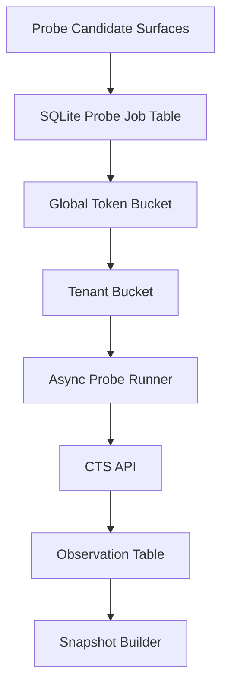

# 04. CTS 离线探测与限速设计

## 目标

CTS API 已经是一个可用搜索引擎：输入关键词，返回候选列表和 `data.total`。关键词图谱包要利用 `data.total` 作为词面可搜性观察，但不能把 CTS key 或 CTS 探测能力分发给用户。

本设计目标：

1. CTS 探测只发生在我们内部的 snapshot 构建流程中。
2. 用户本地 runtime 不持有 CTS key，不实时调用 CTS。
3. 批量探测 surface 时不打爆 CTS。
4. 探测结果可复盘、可缓存、可重建 snapshot。
5. Snapshot 只保存聚合数量，不保存 candidate 列表或简历正文。

## 探测对象

第一阶段只探测关键词 surface。

不探测：

- 公司名。
- 部门名。
- 行业领域词作为独立维度。
- 简历全文。
- 候选人个人信息。

## 请求模型

实际 CTS 请求使用现有接口：

```text
POST /thirdCooperate/search/candidate/cts
```

第一版 count-only probe 使用：

| 字段 | 说明 |
| --- | --- |
| `keyword` | 实际输入 CTS 的关键词 |
| `page` | 固定为 1 |
| `pageSize` | 固定为 1，避免拉取候选列表 |
| `trace_id` | 请求追踪 header |
| `tenant_key` / `tenant_secret` | 只在内部构建环境使用 |

返回读取：

| 字段 | 说明 |
| --- | --- |
| `data.total` | 召回数量，作为 `hit_count` / `latest_cts_total` |
| `code` / `status` / `message` | 状态 |
| latency | 客户端测量 |

不保存：

- `data.candidates` 内容。
- 简历正文。
- 候选人 ID。
- 联系方式或任何候选人级敏感字段。

## 已确认行为

本机真实 smoke 显示：

| Query | 结果 |
| --- | --- |
| `Python` | HTTP 200，`data.total=336708` |
| `Kubernetes` | HTTP 200，`data.total=29829` |
| `k8s` | HTTP 200，`data.total=58692` |
| `Python Kubernetes` | HTTP 200，`data.total=9813` |
| `"Kubernetes"` | HTTP 200，`data.total=29829` |
| `AIGC` | HTTP 200，`data.total=14013` |

这说明第一版可以使用 `pageSize=1 + data.total` 做召回观察。引号行为看起来与普通关键词相同，不能先假设 CTS 支持精确短语语法。

## 离线限速



### 全局限速

配置项：

- `KEYWORD_GRAPH_CTS_PROBE_MAX_RPS`
- `KEYWORD_GRAPH_CTS_PROBE_MAX_CONCURRENCY`
- `KEYWORD_GRAPH_CTS_PROBE_WINDOW_START`
- `KEYWORD_GRAPH_CTS_PROBE_WINDOW_END`
- `KEYWORD_GRAPH_CTS_PROBE_TIMEZONE`
- `KEYWORD_GRAPH_CTS_PROBE_TIMEOUT_MS`

第一版真实探测默认按以下保守值起步：

| 配置 | 默认 |
| --- | --- |
| `KEYWORD_GRAPH_CTS_PROBE_MAX_RPS` | `1` |
| `KEYWORD_GRAPH_CTS_PROBE_MAX_CONCURRENCY` | `1` |
| `KEYWORD_GRAPH_CTS_PROBE_WINDOW_START` | `09:00` |
| `KEYWORD_GRAPH_CTS_PROBE_WINDOW_END` | `21:00` |
| `KEYWORD_GRAPH_CTS_PROBE_TIMEZONE` | `Asia/Shanghai`，或内部构建机器明确配置的本地时区 |
| `KEYWORD_GRAPH_CTS_PROBE_TIMEOUT_MS` | `5000` |

第一版不设固定 daily cap；实际每日请求量由 `1 RPS` 和 12 小时运行窗口自然限制，约 43200 次 / 天。夜间不探测。后续是否提高 RPS 或扩展运行窗口需要另行确认。

### 去重与 TTL

同一个 `query_text + query_mode + cts_api_version` 在 TTL 内不重复请求。

推荐 TTL：

| 类型 | TTL |
| --- | --- |
| 稳定高频词 | 14 到 30 天 |
| 新词 / 前沿词 | 3 到 7 天 |
| zero hit | 7 天后复查 |
| failed | 指数退避 |
| 人工强制刷新 | 绕过普通 TTL，但仍走限速 |

## 查询模式

第一版只默认启用：

1. `normal`: 直接搜 surface。

以下模式只记录为 future capability，不默认启用：

- `exact_phrase`
- `quoted`
- `boolean_if_supported`

真实 smoke 显示 `"Kubernetes"` 和 `Kubernetes` 返回相同 total，所以第一版不能把引号当作精确短语能力。

## 失败处理

| 失败 | 策略 |
| --- | --- |
| timeout | 重试，指数退避 |
| 429 | 降速，延迟重试 |
| 5xx | 降速，保留旧观察 |
| 4xx 参数错误 | 标记 query_invalid，需要修正 surface |
| auth error | 停止探测，报警，不自动重试 |
| 网络错误 | 重试，但有最大次数 |

失败结果不能覆盖旧可用 observation。

## 审计

每次探测必须记录：

- 为什么创建任务。
- 实际 query_text。
- query hash。
- 发送时间。
- 使用哪个 rate-limit bucket。
- CTS 返回状态。
- `data.total`。
- 是否更新 snapshot 输入。

## 用户侧边界

用户本地 package 只读取 snapshot 中的 observation summary：

- `latest_cts_total`
- `latest_cts_status`
- `latest_cts_observed_at`
- `recall_bucket`

用户本地不会：

- 配置 CTS key。
- 调用 CTS probe。
- 刷新 CTS observation。
- 保存候选人列表。
