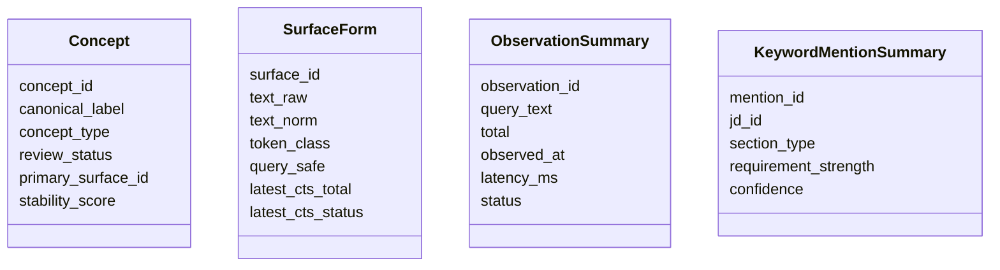
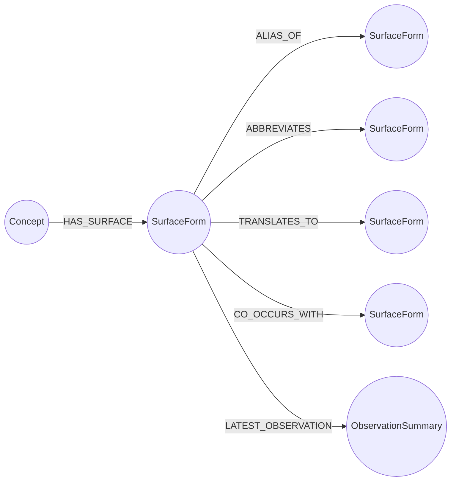
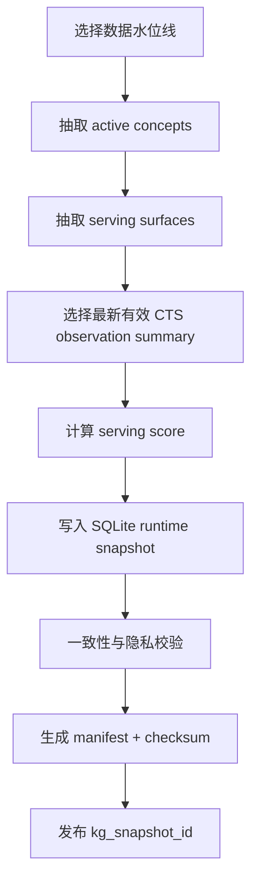

# 05. 图谱构建与刷新

## 构建目标

第一阶段图谱只回答四类问题：

1. 一个 JD 里的关键词应该映射到哪些 Concept？
2. 一个 Concept 有哪些可搜索 SurfaceForm？
3. 每个 SurfaceForm 在 CTS 中大概能召回多少简历？
4. 一个 SurfaceForm 过宽、过窄或零召回时，可以沿哪些关系替换或组合？

## 图谱内容

### 节点



### 边



## 写入策略

构建拆成两个层次：

1. **内部事实账本**：SQLite build DB 保存 JD、mention、surface、concept、probe、observation、review decision 等事实记录。
2. **Runtime snapshot**：从 build DB 投影出一版只读 SQLite 文件，交给 SeekTalent 本地读取。

好处：

- 构建过程可重跑。
- 每次 snapshot 有固定水位线，便于复盘。
- 用户侧不需要数据库服务。
- 大量 CTS observation 明细不需要全部进入 runtime snapshot。

## Snapshot 构建流程



## Serving Score

`serving_score` 不代表候选人质量，只代表一个词面是否适合被推荐为查询词。

建议组成：

```text
serving_score =
  + JD 侧覆盖分
  + CTS 命中区间分
  + 别名置信分
  + 专指程度分
  + 新鲜度分
  - 歧义惩罚
  - 过宽惩罚
  - 过期惩罚
```

每个分量都必须可解释并可单独回放。

## 召回区间标签

单纯 total 不够，需要区间化。

| 标签 | 含义 | Runtime 策略 |
| --- | --- | --- |
| `zero` | 0 命中 | 不直接推荐，走 alias / broader fallback |
| `too_narrow` | 极低命中 | 可作为 precision 或 exploration，不做 anchor |
| `healthy` | 合理命中 | 可做 anchor 或 precision |
| `too_wide` | 过高命中 | 不单独推荐，需要 companion term |
| `unknown` | 没有观察 | 低置信，只返回 warning |
| `stale` | 观察过期 | 可用但带 warning，不触发本地 probe |

阈值不在文档中写死，应按 CTS 总规模、岗位类型、历史效果校准。

## 图遍历策略

### 零召回

```text
SurfaceForm -> ALIAS_OF / ABBREVIATES / TRANSLATES_TO -> serving surfaces
```

如果同概念别名仍然 zero，再退到上位关键词或强共现关键词，但必须标记为 fallback，不能伪装成精准词。

### 过宽召回

```text
SurfaceForm -> CO_OCCURS_WITH -> companion surfaces
SurfaceForm -> Concept -> narrower concepts -> surfaces
```

生成组合查询，而不是盲目换同义词。

### 歧义词

歧义词不自动扩展。先找能 disambiguate 的 companion surface，例如：

- `go` 可能是语言，也可能是动词；应优先使用 `Golang` 或 `Go语言`。
- `prompt` 可能是提示词，也可能是命令行提示；要结合 JD 证据。

### 新词

新词默认进入 `exploration`，不进入 `anchor`。等 CTS 观察、自动证据和抽样检查稳定后再升级。

## 刷新节奏

| 作业 | 推荐频率 |
| --- | --- |
| 新 JD 导入 | 按批次 |
| 关键词抽取 | 每批 JD 后 |
| 共现统计 | 每批次后或每周 |
| CTS count probe | 内部低速批处理，`1 RPS / 并发 1`，09:00-21:00 运行 |
| Runtime snapshot | 手动候选发布；稳定后目标两周一次 |
| 评估集回放 | 每个候选 snapshot 发布前 |

## Snapshot 发布门禁

一个 snapshot 必须通过：

- schema 校验。
- active concept 无孤儿 primary surface。
- serving surface 必须有有效或允许 stale 的 CTS observation。
- 不包含 company / department / industry 节点。
- 不包含 CTS key、candidate list、简历正文。
- 高风险 merge / split 有自动证据；没有证据时保守阻断，不等待大规模人工复核。
- 回放评估不低于上一版关键指标。
- 压缩后 snapshot `<100MB`，目标 `<50MB`。

## 回滚

新 snapshot 使用后出现以下情况应回滚：

- 推荐词中出现大量公司 / 部门误判。
- 查询稳定性明显下降。
- SeekTalent artifacts 中出现大面积 keyword warning。
- snapshot 打开失败或体积异常。

回滚只需要把 SeekTalent 配置指回上一版 snapshot，不需要改写历史数据。
