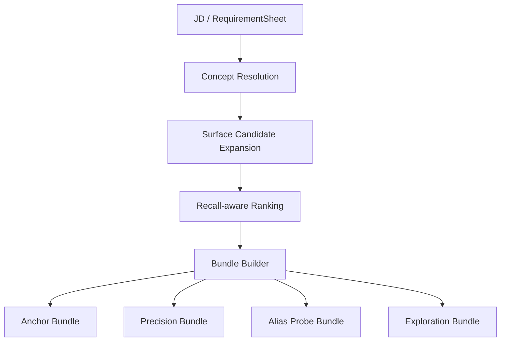

# 06. Runtime 决策与查询词组合

## 输入

关键词包接收两类输入：

1. 原始 JD：`job_title + jd_text + notes`。
2. SeekTalent 已经抽好的 `RequirementSheet` 或关键词草案。

推荐 SeekTalent 第一阶段同时传两者：原始文本用于证据定位，RequirementSheet 用于和现有运行时对齐。

## 输出

Package 不输出“一个最终关键词列表”，而是输出查询族。



## Concept Sheet

`concept_sheet` 是中间解释对象。

示例：

```json
{
  "concept_id": "concept_kubernetes",
  "label": "Kubernetes",
  "source_terms": ["k8s", "容器编排"],
  "requirement_strength": "required",
  "evidence": [
    {"section": "requirement", "text": "熟悉 Kubernetes / Docker 容器化部署"}
  ],
  "confidence": 0.92
}
```

## Surface 候选扩展

对每个 concept 获取候选 surface：

- primary surface。
- verified alias。
- abbreviation。
- translation。
- high-confidence co-occurring surface。

候选 surface 要进入打分，不直接推荐。

## Surface 打分

建议排序因子：

| 因子 | 作用 |
| --- | --- |
| `requirement_strength` | 必选项优先 |
| `surface_confidence` | 词面和 concept 的关系置信度 |
| `latest_cts_total` | 预计算召回数量 |
| `recall_bucket` | zero / healthy / too_wide 等标签 |
| `specificity_score` | 精确度 |
| `ambiguity_score` | 歧义惩罚 |
| `freshness_score` | 观察新鲜度 |
| `stability_score` | 历史选择稳定性 |

## QueryBundle 类型

### Anchor Bundle

目标：稳定拿到第一批候选。

规则：

- 只包含 `healthy` 或允许 stale 的高置信 surface。
- 不使用强歧义词。
- 不使用探索词。
- 数量少，避免 query 过长。

示例：

```json
{
  "bundle_type": "anchor",
  "queries": [
    {"text": "Kubernetes", "expected_hit_count": 29829, "reason": "primary_surface_healthy"},
    {"text": "Python Kubernetes", "expected_hit_count": 9813, "reason": "cooccurrence_precision"}
  ]
}
```

### Precision Bundle

目标：收窄过宽词。

规则：

- 一个过宽词必须搭配 companion term。
- companion term 来自同 JD 的 required keyword 或强共现边。
- 若 CTS 不支持布尔语法，则返回多条候选 query，交给 SeekTalent 逐轮尝试。

### Alias Probe Bundle

目标：同概念别名试探。

规则：

- 适合 `SurfaceForm` 之间召回差异大时使用。
- 每个 alias 都要说明它和 primary surface 的关系。
- 不要把所有 alias 一次性发给 CTS；让 SeekTalent 按预算执行。

### Exploration Bundle

目标：新词发现和长尾覆盖。

规则：

- 默认低优先级。
- 只在 anchor / precision 结果不足时使用。
- 必须明确标记 `exploration=true`。

### Fallback Bundle

目标：关键词包不确定或 snapshot 覆盖不足时兜底。

来源：

- SeekTalent 原有 term extraction。
- JD 标题。
- 用户 notes。

必须明确告诉 SeekTalent 这是 fallback，不应混入“图谱确认过”的结果。

## 拒绝原因

Runtime 必须返回被拒词面，因为这有助于调试。

| 原因 | 说明 |
| --- | --- |
| `company_like` | 疑似公司名，第一阶段不处理 |
| `department_like` | 疑似部门 / 组织名，第一阶段不处理 |
| `too_generic` | 过泛，如“沟通能力” |
| `zero_recall` | 预计算 CTS total 为零 |
| `too_wide_without_companion` | 过宽且没有收窄词 |
| `stale_observation` | 观察过期，不进入 anchor |
| `low_confidence_alias` | 别名关系低置信 |
| `policy_blocked` | 策略禁止 |

## 决策伪流程

```text
for each extracted concept:
    surfaces = snapshot.expand(concept)
    score each surface
    reject unsafe / company-like / department-like / zero-without-alias surfaces
    assign healthy surfaces to anchor or precision
    assign low-confidence aliases to alias_probe
    assign new terms to exploration
build bundles under query budget
return bundle + lineage + rejected_surfaces
```

## 稳定性要求

同一输入、同一 `kg_snapshot_id`、同一配置，package 必须返回相同结果。任何随机性都要固定 seed 或移出 runtime 路径。

## 延迟预算

Runtime 只做本地 SQLite 查询和轻量打分，不做 CTS probe。

建议目标：

- P50 < 50ms。
- P95 < 200ms。
- snapshot 不可用时由 SeekTalent fail-open 回退原策略。

具体值要根据真实 SeekTalent 集成环境校准。
