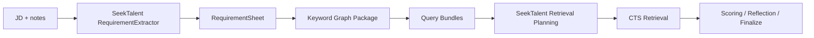
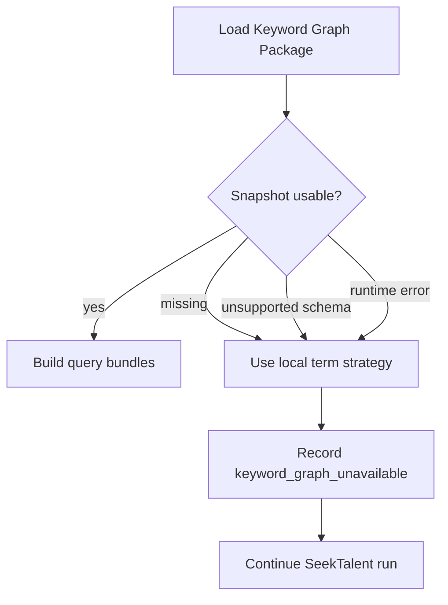

# 08. 与 SeekTalent 的集成方式

## 集成定位

关键词图谱包应插在 SeekTalent 的 requirement extraction 和 retrieval planning 之间。



SeekTalent 仍然负责：

- 主运行时编排。
- CTS 实际检索。
- 候选人去重。
- 简历评分。
- 反思与最终输出。
- artifacts 写入。

关键词图谱包负责：

- 读取本地 SQLite snapshot。
- 关键词 concept / surface lookup。
- recall-aware 词面选择。
- 返回 query bundles 和 lineage。

关键词图谱包不负责：

- 持有 CTS key。
- 实时探测 CTS 召回数量。
- 执行 CTS retrieval。
- 直接访问 SeekTalent controller。

## 调用方式

SeekTalent 通过 Python dependency 调用：

```python
from seektalent_keyword_graph import KeywordGraph, QueryPlanRequest

engine = KeywordGraph.open(settings.keyword_graph_snapshot_path)
response = engine.build_query_plan(request)
```

第一阶段不通过 HTTP 调用，不需要 `SEEKTALENT_KEYWORD_GRAPH_BASE_URL`。

## 调用时机

在 `RequirementSheet` 生成后调用。

原因：

- RequirementExtractor 已经把 JD 变成结构化需求。
- 关键词图谱包不需要理解完整业务编排。
- 这样不破坏 SeekTalent 现有 deterministic runtime。

## SeekTalent 侧新增 artifacts

建议在每次 run 中增加：

| artifact | 内容 |
| --- | --- |
| `keyword_graph_request.json` | 调用请求 |
| `keyword_graph_response.json` | 原始响应 |
| `keyword_query_bundles.json` | 被 runtime 采纳后的查询族 |
| `keyword_lineage.json` | 关键词选择链路 |
| `keyword_graph_warnings.json` | 低置信、snapshot 过期、package 不可用等 warning |
| `keyword_feedback_payload.json` | run 结束后可选回写的反馈摘要 |

这些 artifacts 与现有 `search_diagnostics.json`、`term_surface_audit.json` 应该互相引用。

## 降级路径



原则：关键词图谱包故障不能阻塞顾问完成检索。

## 配置开关

SeekTalent 侧建议增加环境变量：

| 配置 | 说明 |
| --- | --- |
| `SEEKTALENT_KEYWORD_GRAPH_ENABLED` | 是否启用 package |
| `SEEKTALENT_KEYWORD_GRAPH_SNAPSHOT_PATH` | SQLite snapshot 路径 |
| `SEEKTALENT_KEYWORD_GRAPH_SNAPSHOT_ID` | 固定快照，默认 latest |
| `SEEKTALENT_KEYWORD_GRAPH_FAIL_OPEN` | 失败是否继续，默认 true |
| `SEEKTALENT_KEYWORD_GRAPH_MAX_BUNDLES` | 最大查询族数量 |

不需要：

- `SEEKTALENT_KEYWORD_GRAPH_BASE_URL`
- 用户侧 CTS key
- 用户侧 probe 配置

## 数据回写

SeekTalent 每轮 CTS 检索后可以把聚合效果写入本地 artifacts，供我们后续内部构建新版 snapshot 时分析。第一版采用本地文件手动导出，不做自动上传；只要不离开本机和不包含候选人级数据，就不把它设计成需要额外审批的流程。

- 实际发送的 query。
- CTS 返回的 hit count。
- 打开的候选数量。
- Match / Maybe 数量。
- query 是否被后续 round 继续使用。

第一阶段不回写简历正文，不回写敏感字段，不上传候选人级数据。允许使用 query-level 聚合反馈改进下一版 snapshot。

## 采纳策略

SeekTalent 不应该无条件执行所有 query bundles。建议策略：

1. 优先执行 `anchor`。
2. 若召回过宽，执行 `precision`。
3. 若召回过窄或为零，执行 `alias_probe`。
4. 若仍不足，再考虑 `exploration`。
5. 每轮执行预算由 SeekTalent runtime 控制。

## 与本地优先的关系

SeekTalent 是 local-first 产品；关键词图谱包也应保持 local-first。

用户本地只需要：

- Python package。
- SQLite snapshot。

用户本地不需要：

- Docker。
- Neo4j。
- PostgreSQL。
- Redis。
- CTS key。

## 接入里程碑

| 阶段 | 接入方式 |
| --- | --- |
| M1 | 独立包生成本地 query bundles，不接 SeekTalent |
| M2 | SeekTalent 用 feature flag 调用 package |
| M3 | SeekTalent artifacts 写入 request / response / lineage |
| M4 | 固定评估集对比原策略和 package 策略 |
| M5 | 基于反馈构建新版 snapshot |
