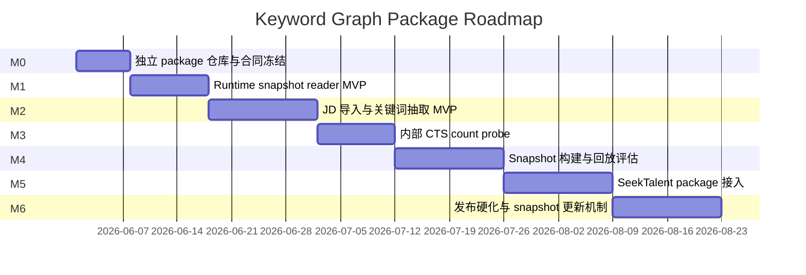

# 10. 路线图与风险

## 总体路线

实际日期可调整，上图表达依赖顺序。

## M0：开仓与设计冻结

交付物：

- 独立代码仓库。
- Package 名称和目录结构。
- Pydantic request / response 草案。
- SQLite snapshot schema 草案。
- README 写明：无 UI、无常驻服务、用户本地无 CTS key。

验收：

- 不与 SeekTalent 仓库混写代码。
- 第一阶段范围明确：只做关键词。
- 有可执行的第一批 issue。

## M1：Runtime Snapshot Reader MVP

交付物：

- `KeywordGraph.open(snapshot_path)`。
- snapshot schema 校验。
- surface / concept lookup。
- minimal `build_query_plan()`。
- package install smoke。

验收：

- 不需要 CTS key 即可运行 runtime。
- 同一输入同一 snapshot 输出稳定。
- macOS / Windows 路径处理通过测试。

## M2：JD 导入与关键词抽取 MVP

交付物：

- 9530 条中国大陆公开 JD 样本导入。
- 去重与文本清洗。
- 段落切分。
- 规则 / 词典 / 统计关键词抽取。
- 初始 `SurfaceForm` 与 `KeywordMention` 表。

验收：

- 能生成可审查关键词候选。
- 能回溯每个关键词来自哪份 JD 的哪段文本。
- 公司 / 部门 / 行业词不进入第一阶段 snapshot。

## M3：内部 CTS Count Probe

交付物：

- Count-only CTS client。
- `page=1`、`pageSize=1`。
- 读取 `data.total`。
- SQLite probe job / observation 表。
- fake CTS fixture。
- 本机真实小流量 smoke 记录。

验收：

- fake CTS 测试通过。
- 真实 CTS 小流量 smoke 通过。
- Runtime package 不 import CTS client。
- Snapshot 不包含 CTS key 或 candidate list。

## M4：Snapshot 构建与回放评估

交付物：

- `build-snapshot`。
- `validate-snapshot`。
- manifest / checksum。
- replay eval。
- snapshot diff report。

验收：

- candidate snapshot 可被 runtime 只读打开。
- 关键评估集 query 稳定。
- snapshot 压缩后目标 `<50MB`，硬上限 `<100MB`。
- secret / candidate scan 通过。

## M5：SeekTalent Package 接入

交付物：

- SeekTalent dependency 引入。
- requirement extraction 后调用 package。
- 新增 artifacts。
- fail-open 回退。
- query outcome feedback 摘要。

验收：

- 关键词包关闭时 SeekTalent 仍能完整跑。
- 关键词包开启后 artifacts 能完整复盘。
- 固定评估集上 query 稳定性和零召回率改善。

## M6：发布硬化与更新机制

交付物：

- release workflow。
- snapshot 手动发布与两周目标节奏。
- 安全审计。
- 数据保留策略。
- 极少量抽样检查流程。

验收：

- 能发布 wheel + snapshot。
- 能回滚 snapshot。
- 能发现词面漂移。
- 能防止坏 snapshot 发布。

## 主要风险

### 风险 1：别名错误合并

后果：query 变宽，候选质量下降。

缓解：

- 高频 merge 必须有足够自动证据；证据不足时默认不合并。
- 保留 split 操作。
- 每个 snapshot 做 diff。
- SeekTalent 回写实际效果。
- 每天最多 10 分钟抽样检查高风险 diff。

### 风险 2：CTS API 承压

后果：内部搜索服务被打爆，影响业务。

缓解：

- CTS probe 只在内部构建环境运行。
- 初始 `1 RPS / 并发 1`，只在 09:00-21:00 运行。
- 限速、退避和暂停。
- 不设固定 daily cap；如果出现 429、延迟异常或业务方反馈，立即暂停并降速。

### 风险 3：把非关键词混进图谱

后果：第一阶段失焦，工程复杂度爆炸。

缓解：

- `concept_type` 白名单。
- company_like / department_like 检测。
- snapshot 发布门禁。
- 非关键词只留原始元数据，不建节点。

### 风险 4：热门词偏置

后果：系统总推荐宽泛高频词，实际 precision 下降。

缓解：

- `too_wide` 标签。
- companion term 必选。
- 业务反馈指标闭环。

### 风险 5：上线后不可复盘

后果：无法解释为什么某次 SeekTalent 搜了某个词。

缓解：

- 所有响应带 snapshot、policy version、lineage。
- SeekTalent 写 artifacts。
- 保留 snapshot 和输入 hash。

### 风险 6：包体或依赖膨胀

后果：跨平台本地使用体验变差，用户不愿安装。

缓解：

- 第一版只用 Python + SQLite + Pydantic。
- 不引入图数据库、常驻服务或容器运行要求。
- 对 wheel 和 snapshot 体积设 release gate。

### 风险 7：过早做大图谱

后果：公司、领域、部门实体清洗消耗大量资源，关键词包无法交付。

缓解：

- M1-M6 明确只做关键词。
- 后续节点类型必须走新 RFC。
- 所有文档和 schema 都把非关键词标成 out of scope。
