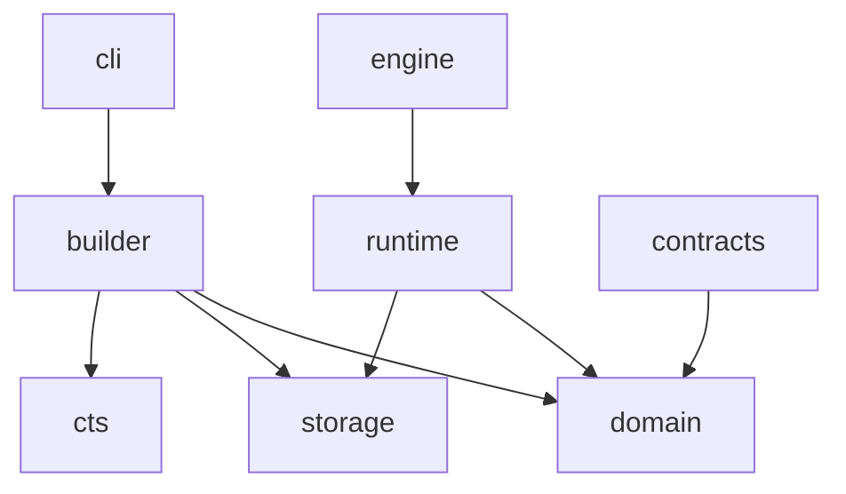

# 01. 仓库结构设计

## 仓库名建议

```text
seektalent-keyword-graph
```

不要放进 SeekTalent 主仓库。SeekTalent 通过 Python dependency 和稳定 contract 调用本包。

## 顶层结构

```text
seektalent-keyword-graph/
  README.md
  pyproject.toml
  uv.lock
  .env.example
  .gitignore
  Makefile
  docs/
  contracts/
  snapshots/
  scripts/
  src/
  tests/
  data.example/
```

第一版不要求 Dockerfile 或 docker-compose。需要内部批处理环境时，可以后续补 builder-only Docker，但不作为用户运行依赖。

## `src/` 结构

```text
src/seektalent_keyword_graph/
  __init__.py
  engine.py
  config.py
  cli.py
  contracts/
    __init__.py
    api_models.py
    snapshot_models.py
  domain/
    __init__.py
    models.py
    normalization.py
    scoring.py
    policies.py
  runtime/
    __init__.py
    snapshot_store.py
    concept_resolver.py
    surface_selector.py
    bundle_builder.py
  builder/
    __init__.py
    import_jds.py
    extract_surfaces.py
    build_relations.py
    cts_probe.py
    build_snapshot.py
    validate_snapshot.py
  cts/
    __init__.py
    count_client.py
  storage/
    __init__.py
    sqlite_schema.py
    sqlite_migrations.py
  observability/
    __init__.py
    build_report.py
```

## 分层规则

依赖方向：



禁止：

- `runtime` 调用 CTS。
- `runtime` 读取 `.env` 中的 CTS key。
- `domain` import `builder`。
- `domain` import `cts`。
- 本包 import SeekTalent runtime。
- SeekTalent 读取本包内部 SQLite 表，除非通过公开 API。

## `contracts/`

```text
contracts/
  examples/
    query-plan.request.json
    query-plan.response.json
  schemas/
    query-plan-request.schema.json
    query-plan-response.schema.json
    snapshot-meta.schema.json
  compatibility.md
```

用途：

- 固定 SeekTalent 与关键词 package 之间的 Python/JSON contract。
- 给 SeekTalent 写消费方测试。
- 约束 response 字段兼容性。

## `snapshots/`

```text
snapshots/
  README.md
  latest.sqlite3.sha256
  manifests/
    kg_2026_05_30_001.json
```

实际 `.sqlite3` snapshot 可以不提交到 git，可通过 release artifact 或内部分发渠道发布。仓库内只保留小型测试 snapshot。

## `docs/`

```text
docs/
  architecture.md
  snapshot-schema.md
  query-plan-contract.md
  cts-offline-probe.md
  seektalent-integration.md
  runbooks/
    rebuild-snapshot.md
    rollback-snapshot.md
    cts-probe-paused.md
  decisions/
    ADR-0001-package-not-service.md
    ADR-0002-sqlite-snapshot.md
```

## `tests/`

```text
tests/
  unit/
  contract/
  fixtures/
    snapshots/
    jd_samples/
    cts_probe_responses/
  integration/
```

测试重点：

- surface normalization。
- recall bucket 判断。
- bundle builder。
- snapshot schema 兼容。
- SQLite query performance。
- CTS count client 只在 fake response 下测试。
- runtime 不读取 CTS key。

## `scripts/`

```text
scripts/
  import_jd_corpus.py
  build_snapshot.py
  validate_snapshot.py
  export_contract_examples.py
  run_eval_replay.py
```

脚本调用 package 的 builder API，不直接绕过 schema 随意写 SQLite。

## Makefile 命令建议

```text
make sync
make lint
make typecheck
make test
make contract-test
make build-test-snapshot
make validate-snapshot
make eval-replay
```

## 仓库内文档同步

任何 request / response contract、snapshot schema、selection policy 的变化都要同步更新 docs 和 contracts。CI 中应有 contract fixture 校验，避免文档漂移。
