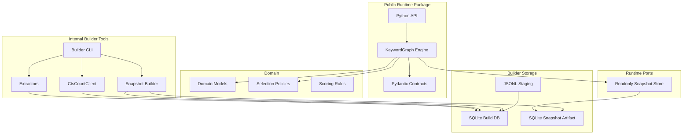

# 02. 分层与解耦

## 目标

第一阶段不是关键词服务，而是一个独立轻量 Python package。它有两个清晰运行面：

1. **Runtime package**：在用户本地被 SeekTalent import，读取只读 SQLite snapshot，返回 query bundles。
2. **Internal builder tools**：在我们内部环境构建 snapshot，导入 JD、抽取 surface、探测 CTS count、校验并发布快照。

这两个运行面必须分开。Runtime 不能读取 CTS key，不能调用 CTS，不能依赖构建环境。

## 分层总图



## Domain 层

Domain 只包含业务概念和纯规则：

- `Concept`
- `SurfaceForm`
- `KeywordMention`
- `CTSRecallObservation`
- `KeywordGraphSnapshot`
- `QueryBundle`
- `ReviewDecision`

Domain 可以包含：

- 词面规范化。
- `query_safe` 判断。
- recall bucket 判断。
- serving score 计算。
- bundle 类型选择。
- rejected surface reason 计算。

Domain 不能知道：

- CTS credential。
- SQLite SQL 细节。
- SeekTalent runtime 内部模块。
- Builder CLI 参数。
- 文件系统路径。

## Runtime 层

Runtime 层只处理本地同步读：

| 模块 | 职责 |
| --- | --- |
| `KeywordGraph.open(snapshot_path)` | 打开并校验 SQLite snapshot |
| `BuildQueryPlan` | 从输入需求生成 `QueryPlanResponse` |
| `LookupSurface` | 本地调试 lookup |
| `SnapshotValidator` | 校验 schema、版本和完整性 |

Runtime 禁止：

- 调 CTS。
- 读取 `.env` 中的 CTS 配置。
- 创建 probe job。
- 写入 snapshot。
- 启动 HTTP server 或后台进程。

## Builder 层

Builder 是内部离线流程，可以比 runtime 重，但第一版仍保持 SQLite + CLI：

| Use Case | 职责 |
| --- | --- |
| `ImportJdBatch` | 导入公开 JD 样本、去重、保存来源引用 |
| `ExtractSurfaces` | 抽取 `KeywordMention` 和候选 `SurfaceForm` |
| `BuildRelations` | 生成别名、缩写、翻译、共现关系 |
| `ProbeCtsCounts` | 使用内部 CTS key 做 count-only 探测 |
| `BuildSnapshot` | 生成发布用只读 SQLite snapshot |
| `ValidateSnapshot` | 回放评估、schema 校验、隐私检查 |

Builder 可以读取内部 secret，但输出物不能包含 secret、候选人列表或简历正文。

## Ports

第一版接口保持窄：

```text
ReadonlySnapshotStore:
  get_snapshot_meta()
  resolve_concepts(terms)
  expand_surfaces(concept_ids)
  find_related_surfaces(surface_id, relation_types, limit)
  get_recall_summary(surface_ids)

BuildStore:
  upsert_jd_documents(batch)
  upsert_mentions(batch)
  upsert_surfaces(batch)
  upsert_relations(batch)
  upsert_cts_observations(batch)
  export_runtime_snapshot(path)

CtsCountClient:
  search_count(query_text, query_mode, timeout_ms)
```

这些是边界说明，不要求一次性写成复杂抽象。只要具体实现不穿透边界即可。

## Adapters

第一版 adapters：

- `runtime/sqlite_snapshot.py`：只读 SQLite snapshot。
- `builder/sqlite_build_store.py`：内部构建数据库。
- `builder/jsonl_importer.py`：JD staging 输入。
- `cts/count_client.py`：内部 CTS count-only HTTP client。

不引入：

- Neo4j adapter。
- PostgreSQL adapter。
- Redis / queue adapter。
- FastAPI routes。
- Celery worker。

## 与 SeekTalent 解耦

关键词包可以作为 SeekTalent dependency，但不要 import SeekTalent。

集成方式：

- Python package API。
- Pydantic request / response model。
- JSON schema examples。
- Consumer contract tests。

SeekTalent 侧也不应读取 snapshot 内部表；只调用 package API。

## 架构测试

建议 CI 加 import boundary 检查：

| 规则 | 说明 |
| --- | --- |
| `domain` 不依赖 `runtime` / `builder` | 保持领域纯净 |
| `runtime` 不依赖 `builder` | 用户侧包不带构建依赖 |
| `runtime` 不依赖 `cts` | 防止用户侧误触 CTS |
| `contracts` 可被 runtime 和 SeekTalent 消费 | 合同稳定 |
| `builder` 可依赖 domain 和 contracts | 内部工具复用规则 |

## 变更隔离

常见变更应该只影响少数区域：

| 变更 | 应影响 |
| --- | --- |
| QueryBundle 策略调整 | `domain/policies.py` + runtime tests |
| Snapshot schema 新字段 | `storage/sqlite_schema.py` + contract tests |
| CTS 鉴权方式变化 | `cts/count_client.py`，runtime 不受影响 |
| JD 抽取规则增强 | `builder/extractors/` + extraction tests |
| SeekTalent request 字段新增 | `contracts/` + consumer tests |

如果一个小变更需要同时改 runtime、builder、CTS client 和 SeekTalent retrieval runtime，说明边界错了。
