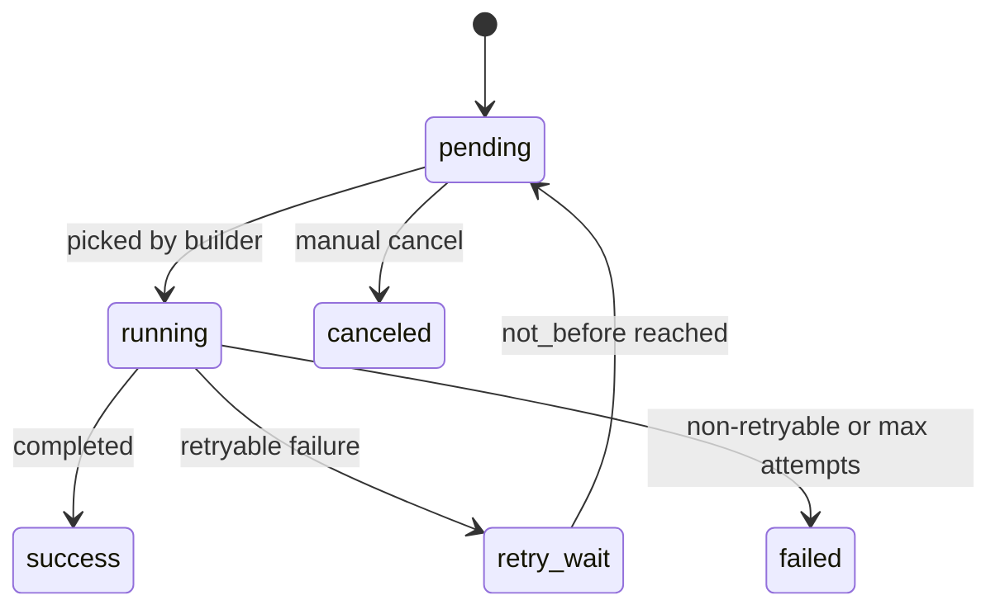
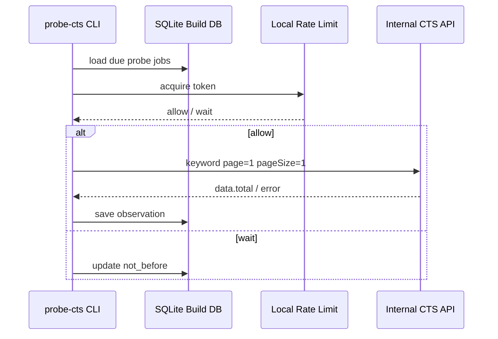

# 04. 内部构建任务与调度

## 定位

第一阶段不运行用户侧 worker，也不要求后台队列。所有长任务都属于我们内部的 snapshot 构建流程，通过 CLI 或脚本批处理执行。

用户本地只做同步 runtime 查询：

```text
SeekTalent -> seektalent_keyword_graph package -> readonly SQLite snapshot -> QueryPlanResponse
```

## 构建任务分类

| 任务 | 职责 | 运行位置 |
| --- | --- | --- |
| `import-jds` | 导入公开 JD 样本、去重、记录来源 | 内部 |
| `extract-surfaces` | 文本清洗、段落切分、关键词抽取 | 内部 |
| `build-relations` | 别名、缩写、翻译、共现关系 | 内部 |
| `probe-cts` | 受限速控制调用 CTS，读取 `data.total` | 内部 |
| `build-snapshot` | 从 build DB 导出 runtime SQLite snapshot | 内部 |
| `validate-snapshot` | schema、隐私、回放和体积校验 | 内部 |

## 调度原则

1. Runtime package 不跑长任务。
2. 所有构建任务必须幂等，可从中间产物恢复。
3. 构建状态落 SQLite build DB，不要求 PostgreSQL。
4. 任务可以串行运行；并行只用于抽取和 CTS probe 这类可控批处理。
5. CTS probe 必须限速、可暂停、可恢复。

## 任务状态机



状态机用于内部 build DB 的 `probe_jobs` 或长批任务记录，不是用户机器上的后台服务。

## JD 导入

第一版输入以本机已确认的 9530 条中国大陆公开 JD 样本为 bootstrap corpus。后续可追加公开 JD 或人工整理样本。

导入动作：

1. 读取 JSONL / CSV / text staging。
2. 计算 `content_hash` 去重。
3. 保存 `source`、`source_ref`、标题和文本引用。
4. 标记语言与质量。
5. 不把公司、领域、部门建成图节点。

幂等键：`source + source_ref + content_hash`。

## 关键词抽取

抽取任务记录：

- extractor name。
- extractor version。
- input corpus version。
- output mention count。
- rejected reason summary。
- failure reason。

抽取器顺序：

1. 高精度规则。
2. 种子词典。
3. 统计 n-gram。
4. LLM assisted extractor，仅用于难例或抽样，不直接写入 serving。

## CTS Count Probe

CTS 探测只在内部构建环境运行。



限速实现要求：

- 全局 token bucket。
- 并发 semaphore。
- 每日运行窗口：09:00-21:00，默认 Asia/Shanghai 或内部构建机器明确配置的本地时区。
- 指数退避。
- auth error 立即暂停。

不需要 Redis；单机构建先用 SQLite job lease 和本地限速即可。未来如果内部构建规模明显增大，再单独评估托管队列。

## 重试策略

| 错误 | 重试 |
| --- | --- |
| timeout | 是，指数退避 |
| 429 | 是，长退避并降速 |
| 5xx | 是，退避 |
| 4xx 参数错误 | 否，标记 invalid |
| auth error | 否，暂停 probe 并报警 |
| network error | 是，有最大次数 |

失败结果不能覆盖旧的可用 observation。

## Snapshot 构建

步骤：

1. 锁定 build DB 水位线。
2. 选择 active concepts 和 query-safe surfaces。
3. 选择每个 surface 的最新有效 CTS observation summary。
4. 写入 runtime snapshot tables。
5. 生成 `snapshot_meta`。
6. 运行一致性、隐私和体积校验。
7. 压缩并发布 snapshot artifact。

## 推荐构建节奏

| 任务 | 频率 |
| --- | --- |
| JD 导入 | 按批次 |
| 关键词抽取 | 每批 JD 后 |
| 共现计算 | 每批次后或每周 |
| CTS 探测 | 内部低速批处理，09:00-21:00 运行 |
| Snapshot 构建 | 手动候选发布；稳定后目标两周一次 |
| 回放评估 | 每个候选 snapshot 必跑 |

## 本地开发模式

开发者默认使用 fake CTS fixture：

- 固定 query 返回固定 total。
- 模拟 timeout / 429 / 5xx。
- 用于 retry 和 snapshot 构建测试。

真实 CTS probe 必须显式配置内部 credentials，且不得在日志、fixtures、snapshot 中泄露。
