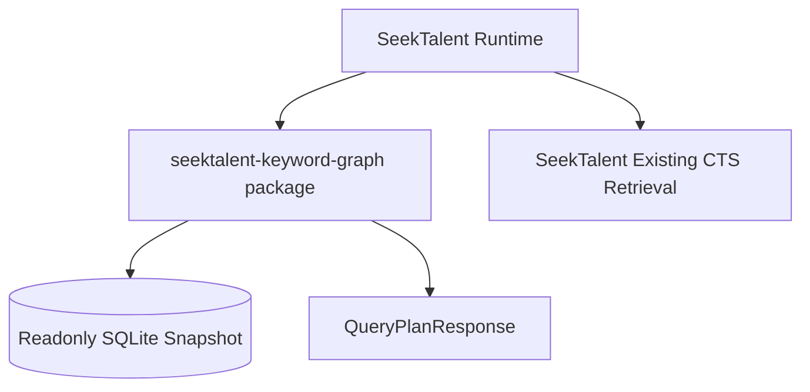
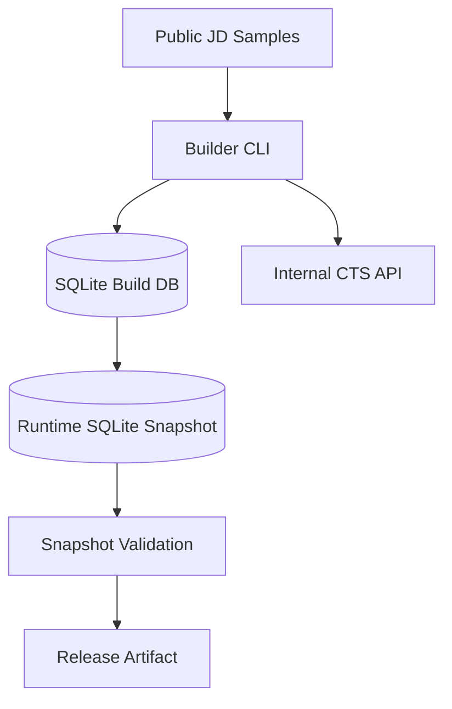

# 06. 运行拓扑与分发

## 用户侧拓扑

第一阶段用户侧没有 Docker、数据库服务或后台进程。



关键词包只负责把 JD / RequirementSheet / notes 变成 query bundles。真正执行 CTS retrieval 的仍然是 SeekTalent。

## 内部构建拓扑



内部构建环境可以读取 CTS credentials；release artifact 不能包含 credentials、candidate list 或简历正文。

## 分发物

`seektalent-keyword-graph` 是单独 GitHub repo。SeekTalent 只依赖这个 repo 发布的 package 和 snapshot artifact，不复制实现代码。

| 分发物 | 说明 |
| --- | --- |
| Python wheel | Runtime package 和必要 contracts |
| SQLite snapshot | 预计算关键词图谱、relations、CTS totals |
| Snapshot manifest | snapshot id、schema version、build time、checksum |
| JSON schema examples | SeekTalent contract tests 使用 |

第一版不拆第二个数据 repo。snapshot 作为同 repo 的 versioned release artifact 发布；仓库只提交小型 test snapshot，不提交完整生产 snapshot。

## 安装方式

SeekTalent 侧作为普通依赖引入：

```text
seektalent-keyword-graph==0.1.0
```

Snapshot 路径通过 SeekTalent 配置传入：

```text
SEEKTALENT_KEYWORD_GRAPH_SNAPSHOT_PATH=/path/to/keyword_snapshot.sqlite3
```

早期内部试用可以把默认 snapshot 随 SeekTalent release 一起放到本地目录，但实现边界仍然是独立依赖包 + 独立 snapshot artifact。

## Runtime 配置

| 变量 | 说明 |
| --- | --- |
| `SEEKTALENT_KEYWORD_GRAPH_ENABLED` | 是否启用关键词包 |
| `SEEKTALENT_KEYWORD_GRAPH_SNAPSHOT_PATH` | 本地 snapshot 路径 |
| `SEEKTALENT_KEYWORD_GRAPH_SNAPSHOT_ID` | 可选：固定 snapshot id |
| `SEEKTALENT_KEYWORD_GRAPH_FAIL_OPEN` | package 异常时是否回退原策略 |
| `SEEKTALENT_KEYWORD_GRAPH_MAX_BUNDLES` | query bundles 上限 |

用户侧不配置：

- CTS base URL。
- CTS tenant key / secret。
- CTS probe RPS。
- Neo4j / PostgreSQL / Redis。

## Snapshot 文件要求

- SQLite 文件默认只读打开。
- 带 `snapshot_meta` 表。
- 带 checksum 或外部 manifest。
- 文件大小目标应保持轻量：压缩后软目标 `<50MB`，硬上限 `<100MB`。
- schema 不兼容时拒绝加载并返回明确错误。

## Docker 定位

Docker 不是用户侧运行要求。

后续如果内部构建流程需要可复现环境，可以增加 builder-only image，但它不进入用户安装路径，也不成为 SeekTalent runtime 依赖。

## 健康检查

没有 `/healthz` 或 `/readyz`。Runtime 启动时做本地校验：

1. snapshot 文件存在。
2. SQLite 可读。
3. `snapshot_meta` 版本兼容。
4. 必要表和索引存在。
5. checksum 与 manifest 一致。

校验失败时由 SeekTalent fail-open 回退。

## 回滚

代码回滚：

- 降级 Python package 版本。

Snapshot 回滚：

- 把 `SEEKTALENT_KEYWORD_GRAPH_SNAPSHOT_PATH` 指回上一版 snapshot。
- 或在 SeekTalent 配置中固定上一 `kg_snapshot_id`。

不需要回滚数据库迁移，也不需要重启外部服务。
